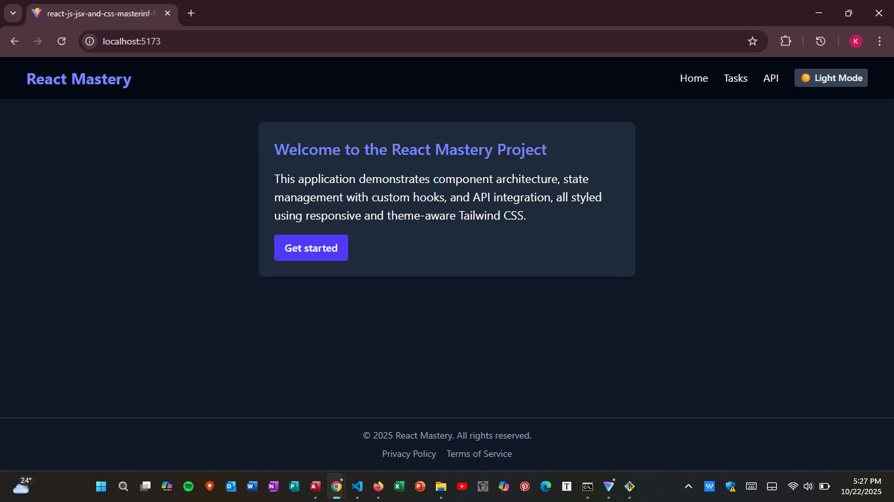
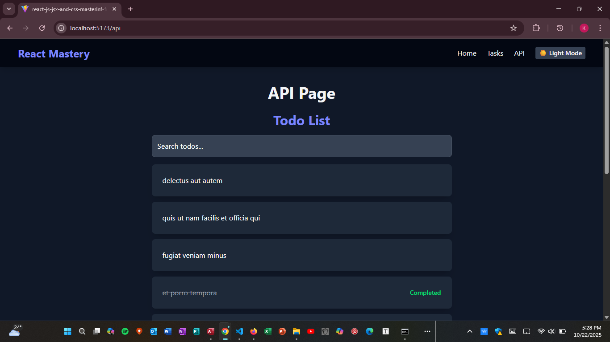
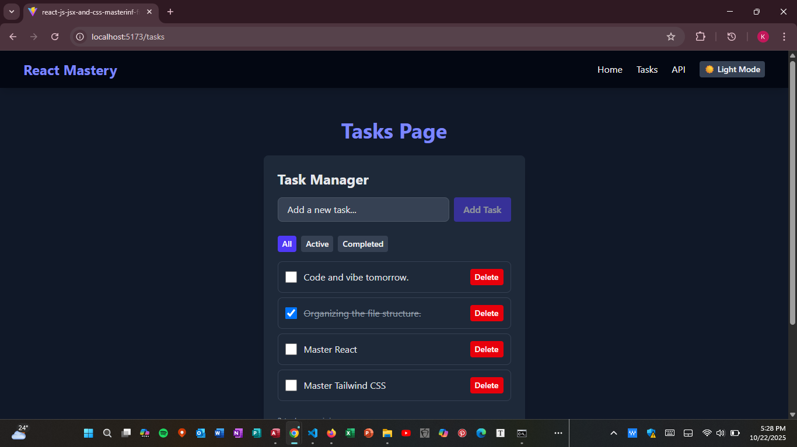

# 🎨 Week 3 Project: React, Hooks, and Tailwind CSS Mastery  

This project demonstrates the core principles of modern front-end development using React (functional components & hooks), React Router, and the CSS-First approach of Tailwind CSS v4.1.  

It features a fully responsive, single-page application (SPA) with real-time state management, API data consumption, and a user-controlled light/dark theme switcher.  

## 🚀 Project Goals & Compliance  

Task  

Status  

### Implementation Details    

###  1: Project Setup    
  

Built with Vite and configured using the modern Tailwind CSS v4.1 Vite plugin and CSS-First configuration (src/index.css).  

### Task 2: Component Architecture    

Implemented reusable Button and Card components. Structure relies on the Layout component (src/components/Layout.jsx) which wraps all routes and hosts the NavBar and Footer.

### Task 3: State Management  

TaskManager uses useState for UI state and the custom hook useLocalStorageTasks (src/hooks/useLocalStorageTasks.js) for data persistence. Theme management uses the Context API (src/context/ThemeContext.jsx).  

### Task 4: API Integration  

ApiList fetches data from JSONPlaceholder (/todos), displays it using the reusable Card component, and implements both loading/error states and client-side pagination.  

### Task 5: Styling

Fully Responsive design across mobile/desktop breakpoints (sm:, md:). Implemented the Light/Dark Mode switcher using the dark: utility prefix and JavaScript control of the <html> root element.  

## 🛠️ Setup and Installation  

Follow these steps in your terminal to get the project running locally:  

Prerequisites  

Node.js (v18 or higher recommended)  

1. Install Dependencies  

npm install  

2. Configure Tailwind CSS (Already set up)  

This project uses the modern Tailwind CSS v4.1 CSS-First approach. All configuration is done in src/index.css, and the build is handled automatically by the official @tailwindcss/vite plugin. No tailwind.config.js is needed.  

3. Start Development Server  

npm run dev  

## 🔗 Deployment and Submission     

1. Deployed Application URL    

## 📸 App Screenshots    

Here are some previews of my Task Manager app:  

## 🖼️ Screenshots  

### Screenshot 1
  

### Screenshot 2
  

### Screenshot 3

